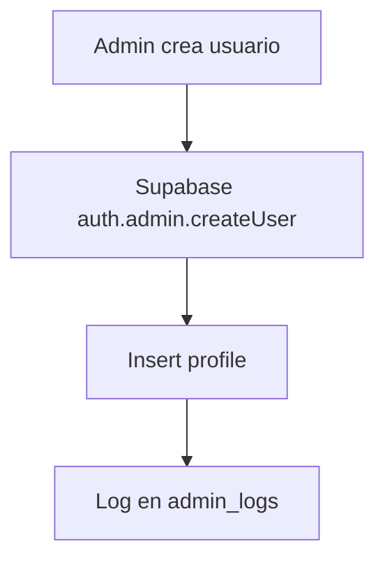
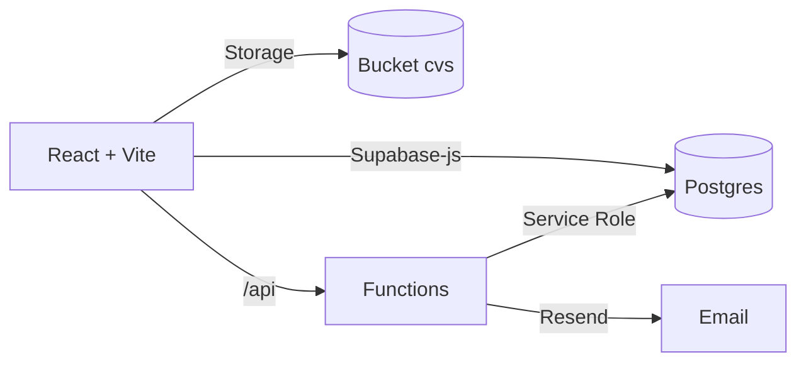

# Documentación Técnica — UniJobs Connect

## 1. Infraestructura y Servicios

- Base de datos: Supabase (Postgres + Auth + Storage)
  - Versión cliente en frontend: `@supabase/supabase-js` 2.76.1
  - Versión cliente en Admin API (server): `@supabase/supabase-js` 2.50.0
  - Tablas principales y relaciones (ver `sql.md`):
    - `profiles` (id → `auth.users.id`, `role`, `company_verified`)
    - `companies` (`owner_id` → `profiles.id`)
    - `jobs` (`company_id` → `companies.id`)
    - `applications` (`job_id` → `jobs.id`, `student_id` → `profiles.id`)
    - `cvs` (`owner_id` → `profiles.id`, JSON `data`, `pdf_url`)
    - `admin_logs` (auditoría, `actor_id` → `profiles.id`)
  - Storage: bucket `cvs` para PDFs (ver `services/cvService.ts`).
  - RLS Policies: ver `sql/rls_policies.sql` (lectura pública de `jobs` activos, acceso por dueño/rol a `companies`, `applications`, `cvs`, y permisos de ADMIN por JWT `user_metadata.role`).
  - Razones de elección: Postgres administrado + Auth integrada, RLS nativa, Storage, Realtime y SDK completo. Alternativas evaluadas: Firebase (NoSQL y reglas menos expresivas), Base de datos propia + ORM (mayor esfuerzo de seguridad y operaciones). Supabase acelera el desarrollo manteniendo control de seguridad y datos.

- Dominio y hosting: Vercel
  - Frontend: build Vite (`npm run build`) y deploy estático.
  - Backend ligero: Functions en `/api` (Node runtimes) para Admin API y correo (Resend).
  - Configuración de despliegue: definir variables de entorno (ver sección 4). Scripts: `dev`, `build`, `preview`.
  - Razones de elección: despliegue simple, CI/CD integrado, edge y serverless sin mantenimiento de servidores. Alternativas: Netlify/Render; Vercel ofrece mejor integración con Vite y funciones.
  - DNS: si se usa dominio propio, apuntar `CNAME` a `cname.vercel-dns.com` o usar el asistente de dominios de Vercel.

## 2. Stack Tecnológico Completo

- Lenguajes: TypeScript (~5.8.2), Node.js (runtime Vercel Functions), JavaScript.
- Frameworks/librerías: React 19.2.0, React Router 7.9.4, Vite 6.2.0, Supabase JS 2.x, Resend 6.2.2.
- Dependencias clave: `@supabase/supabase-js`, `@vercel/speed-insights`, `docx`, `jspdf`, `resend`.
- Herramientas de desarrollo: Vitest 4.0.2, Testing Library, JSDOM, Vite plugin React, TypeScript.

## 3. Funcionalidades Implementadas

- Portal de empleos: listado, detalle y visualización de `jobs` activos.
- Constructor de CV: edición y guardado de CV en `cvs.data` y subida opcional de PDF a Storage.
- Postulaciones: creación y actualización de `applications` por estudiante y empresa.
- Panel Admin: gestión de usuarios (crear, autorizar, borrar), perfiles, empresas, puestos y estados de postulaciones.
- Correo: envío de enlaces de autenticación y emails vía Resend.

- API Endpoints (Functions en `/api`, ver `server/README.md`):
  - `GET /api/health`
  - `POST /api/create-user`, `POST /api/reset-password`, `POST /api/update-profile`, `GET /api/search-users`, `POST /api/authorize-user`, `POST /api/log`
  - `POST /api/create-job`, `POST /api/update-job`
  - `POST /api/send-email`, `POST /api/send-auth-link`

- Diagramas de flujo (Mermaid):

```mermaid
flowchart TD
  A[Alumno edita CV] --> B[saveCV(ownerId, cv)]
  B --> C[Sube PDF a Storage (opcional)]
  C --> D[Actualiza/Inserta en tabla cvs]
  D --> E[Devuelve ok/pdfUrl]
```



## 4. Estructura Estándar de Documentación

- Introducción y objetivos: conectar estudiantes con empresas, centralizar postulaciones y CV.
- Guía de instalación y configuración:
  - Frontend:
    - Variables: `VITE_SUPABASE_URL`, `VITE_SUPABASE_ANON_KEY`, opcional `VITE_ADMIN_API_URL` (`/api` en Vercel) y `VITE_ADMIN_API_TOKEN`.
    - Comandos: `npm install`, `npm run dev` (http://localhost:3000).
  - Admin API / Functions (Vercel o local):
    - Variables: `SUPABASE_URL`, `SUPABASE_SERVICE_ROLE_KEY`, `ADMIN_API_TOKEN`, `RESEND_API_KEY`, opcional `RESEND_FROM`.
    - Scripts: `cd server && npm install && npm run start` (local) o deploy en Vercel.
- Manual de usuario (breve):
  - Estudiante: registrar/iniciar sesión, completar CV, postular a puestos.
  - Empresa: registrar, crear empresa, publicar y gestionar puestos.
  - Admin: crear/autorizar usuarios, editar perfiles, auditar acciones.
- Arquitectura técnica:



- Consideraciones de seguridad:
  - Mantener `SERVICE_ROLE_KEY` solo en backend (Functions/Server).
  - RLS activada y políticas por rol/propietario; revisar `sql/rls_policies.sql`.
  - Proteger Admin API con `ADMIN_API_TOKEN` (cabecera `X-Admin-Token`).
  - Sanitizar y evitar guardar base64 grandes en DB (se guarda `pdf_url`).
- Limitaciones conocidas:
  - Desalineación de versiones Supabase JS entre frontend (2.76.1) y server (2.50.0).
  - El acceso a datos bajo RLS puede requerir endpoints con Service Role para estadísticas/operaciones.
- Roadmap:
  - Unificar versión de `@supabase/supabase-js` en frontend y server.
  - Añadir pruebas e2e y hardening de RLS.
  - Métricas y monitoreo; paginación y filtros avanzados.
  - Mejoras de UX en CV y postulaciones; verificación de empresas.
- Changelog: ver `CHANGELOG.md` en la raíz del repo.

## 5. Decisiones Técnicas

- Supabase vs alternativas: se prioriza Postgres + Auth + Storage + RLS en una plataforma administrada para acelerar sin sacrificar seguridad y control. Firebase/NoSQL implicaba re-modelar consultas y reglas complejas.
- Vercel vs alternativas: simplicidad de deploy, funciones serverless y buen soporte para Vite/React; Netlify/Render similares pero con menor integración percibida.
- React + Vite: rendimiento de desarrollo, ecosistema moderno, compilación rápida.
- TypeScript: tipos en dominio (`types.ts`) y reducción de errores en servicios.

## 6. Ejemplos de código

- Cliente Supabase (frontend):

```ts
// services/supabaseClient.ts
import { createClient } from '@supabase/supabase-js'
const supabaseUrl = import.meta.env.VITE_SUPABASE_URL
const supabaseKey = import.meta.env.VITE_SUPABASE_ANON_KEY
export const supabase = createClient(supabaseUrl || 'http://localhost.invalid', supabaseKey || 'missing')
```

- Guardado de CV y PDF:

```ts
// services/cvService.ts (resumen)
// Subir PDF a bucket 'cvs' y guardar JSON en tabla 'cvs'
```

Referencias adicionales: `server/README.md` (Admin API), `sql.md` (schema), `sql/rls_policies.sql` (RLS).